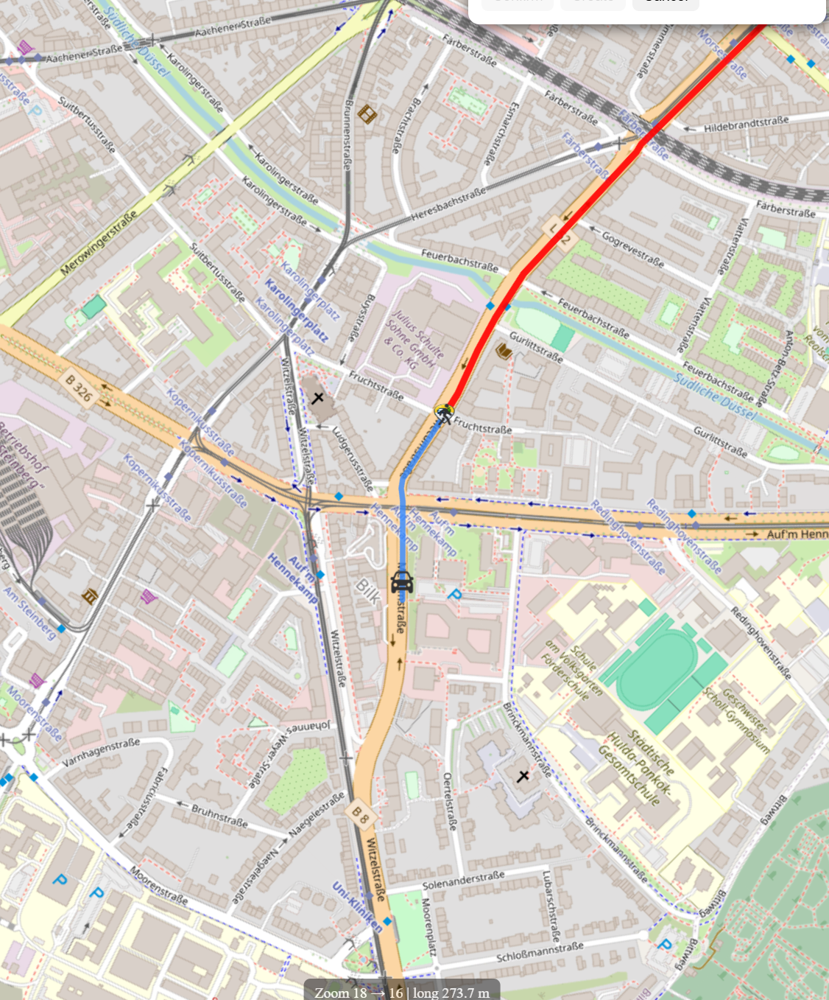
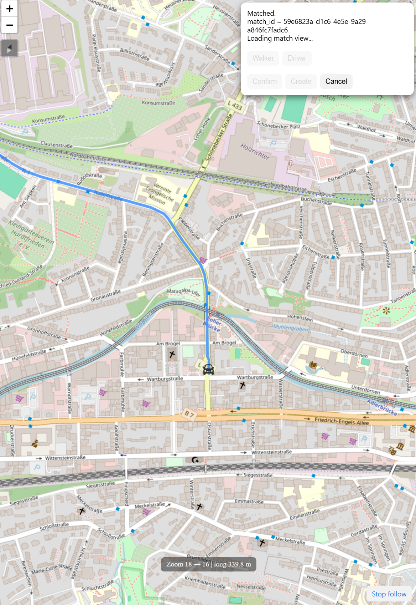
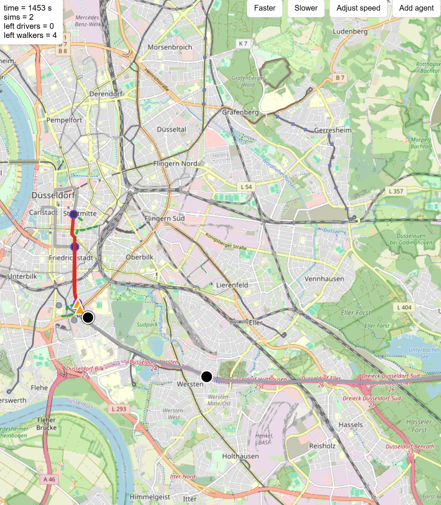

# Real-Time Ride Sharing – Prototype (hobby / concept)

This is a semi-hobby project and still very early stage.  
I hope it can become genuinely useful one day, but right now it’s mainly a concept + technical prototype.

## Concept
Think of it as an “Uber-like” map app, but with a different main idea:

- Drivers are **already traveling** from A → B (they don’t start a trip just to serve a rider).
- Pedestrians (walkers) are going somewhere in the same general direction.
- The system tries to match them so the driver can **pick up a passerby near the route**, drop them off later, and the walker finishes the remaining distance on foot.

So the driver does not fully replace walking — the goal is to reduce walking time/distance by inserting a “ride segment” into the walker’s trip.

### Route matching (pickup & dropoff)

### Navigation view (live zoom & following)

### Simulation overview (multiple agents)

### Mobile view (create an agent, accept a match)

## What works right now
- drivers and walkers can be created on the map (start + destination)
- routes come from a local **OSRM** (one for driving, one for walking)
- matching finds a pickup and a dropoff point on the driver route and picks the best driver
- everything runs as a live simulation, the browser gets updates over **WebSockets**
- overview map for all agents + a mobile page for one user (navigation mode, cancel trip, slide to accept a match)
- tests for backend and frontend

## Run it
1. Start both OSRM servers (Docker Desktop must be running): `code\start_osrm.bat`
2. Install the packages once: `py -m pip install -r code\requirements.txt`
3. Start the server from the `code` folder: `py main.py`
4. Open http://127.0.0.1:8000 and click "Add agent"

Tests (from `code`): `py -m pytest tests`, `node tests/web/test_map.js`, `node tests/web/test_create.js`

## What I want to do next
- make "accept match" real (the server waits until both accepted)
- use the real GPS position from the phone instead of the simulation
- HTTPS (Cloudflare tunnel) so it can be tested on the phone outside the home WLAN
- better matching (more exact pickup times, faster, re-match waiting agents)
- later maybe a real app (Flutter)

## Note
Right now this project is mostly built together with Claude (maybe Codex later too).
